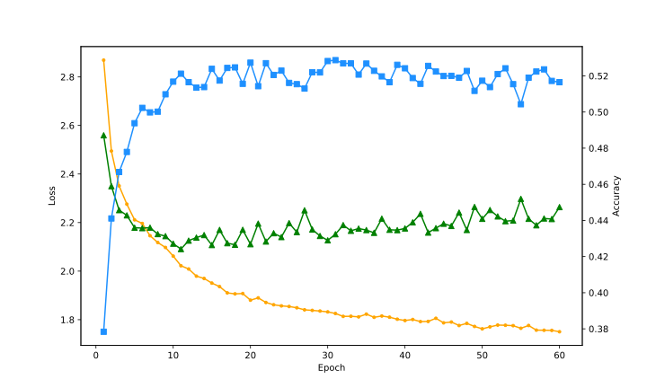
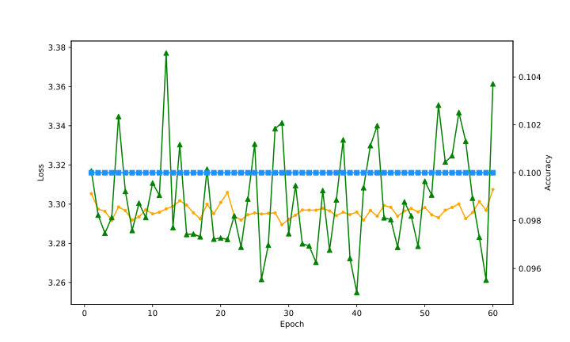
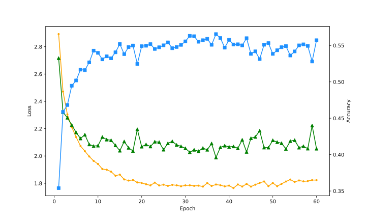
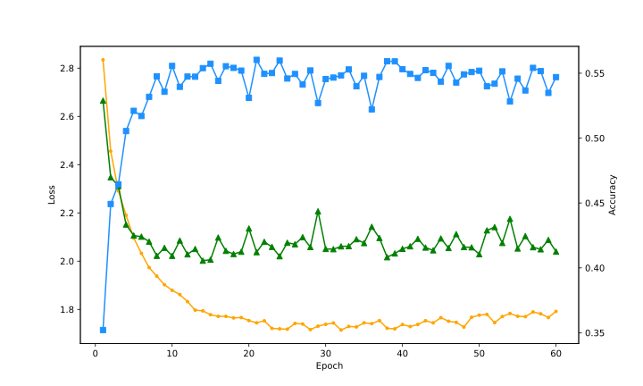
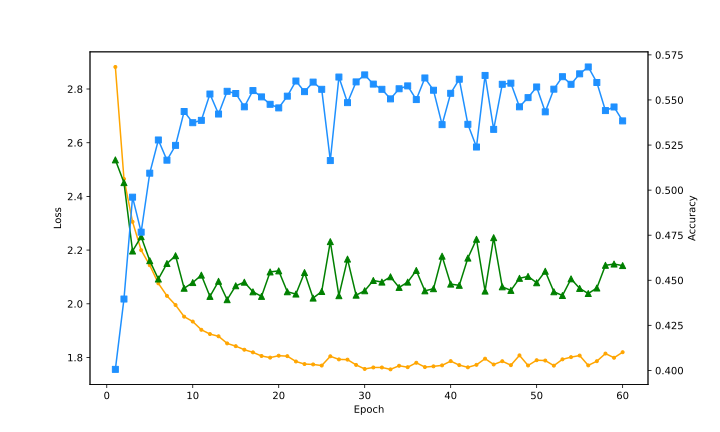
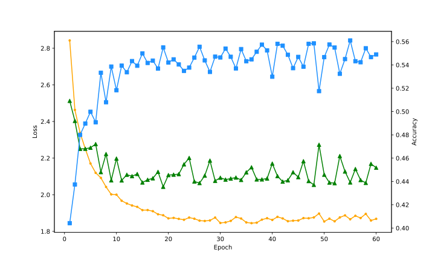

# cifar10-classifier-pytorch
Simple implementation of image classifier for cifar10 dataset.

使用类似于LeNet5的结构在CIFAR-10数据集上进行训练来学习CIFAR-10的数据分布。工具：
* [pytorch](https://pytorch.org/)
* [torchvision.datasets.CIFAR10](https://pytorch.org/vision/stable/generated/torchvision.datasets.CIFAR10.html)

查询了一下，CIFAR-10最新的分类模型已经能够达到接近100%的准确率了

就以下的一些超参数对网络进行调整并观察模型最终的效果。
* 网络的深度
* 卷积核数量(通道数量)
* 使用的池化类型
* dropout率

# 网络的深度
CIFAR-10的每张图像大小为32x32, 刚好是适配原来的LeNet5结构的。如下：

32x32图像，

经过大小为5x5，步长为1的卷积，变为(32-5+1)x(32-5+1)=28x28大小的特征图；

经过2x2池化，变为14x14大小的特征图；

经过大小为5x5，步长为1的卷积，变为(14-5+1)x(14-5+1)=10x10大小的特征图；

经过2x2池化，变为5x5大小的特征图；

再经过大小为5x5，步长为1的卷积，就能变为大小为1x1的特征图，此时的通道数量也变成了特征向量的长度。

我们可以通过将卷积核的大小改为3x3来增加网络的深度。

对应的实现在`models.LeNet5Like`，**后续的实验都以此为baseline**

(蓝线为测试准确率，绿线为测试损失，橙色线为训练损失)
最高测试准确率为56.22%

---

32x32图像，

经过大小为3x3，步长为1的卷积，变为(32-3+1)x(32-3+1)=30x30大小的特征图；

经过2x2池化，变为15x15大小的特征图；

经过大小为3x3，步长为1的卷积，变为(15-3+1)x(15-3+1)=13x13大小的特征图；

经过2x2池化，变为6x6大小的特征图（丢弃掉了一行一列）；

经过大小为3x3，步长为1的卷积，变为(6-3+1)x(6-3+1)=4x4大小的特征图；

经过2x2池化，变为2x2大小的特征图；

因此这里再经过2x2的卷积即可变为1x1的特征图。

对应的实现在`models.LeNet5Like1`

模型运行结果如下：

(蓝线为测试准确率，绿线为测试损失，橙色线为训练损失)

最高准确率为55.84%

加深模型的深度在这里并没用太大作用，不会带来性能的提升。

# 卷积核数量(通道数量)
在baseline的基础上减少一半的卷积核和增加一倍的卷积核，观察模型的效果，对应的实现为`models.LeNet5Like2`, `models.LeNet5Like3`。

只需要将对应的输入输出通道数量减少为原来的一半或增加为原来的两倍即可。

模型运行结果如下：

减少一半的卷积核的结果：最高准确率52.87%

增加一倍的卷积核，似乎产生了一些问题导致无法训练了，验证集准确率始终在10%，相当于一个随机的分类器。

# 使用的池化类型
baseline使用的是最大池化，改成使用平均池化，对应的实现为`models.LeNet5Like4`

最高准确率为56.56%，有了略微的一些提高。

# dropout率
baseline中分类器中的dropout率为0.05，尝试0(就是不dropout)，0.1，0.15，通过模型的参数来进行调整

最高准确率分别为56.03%，56.83%，56.10%，可见dropout率对模型存在一定的影响，但是并没有什么规律。
